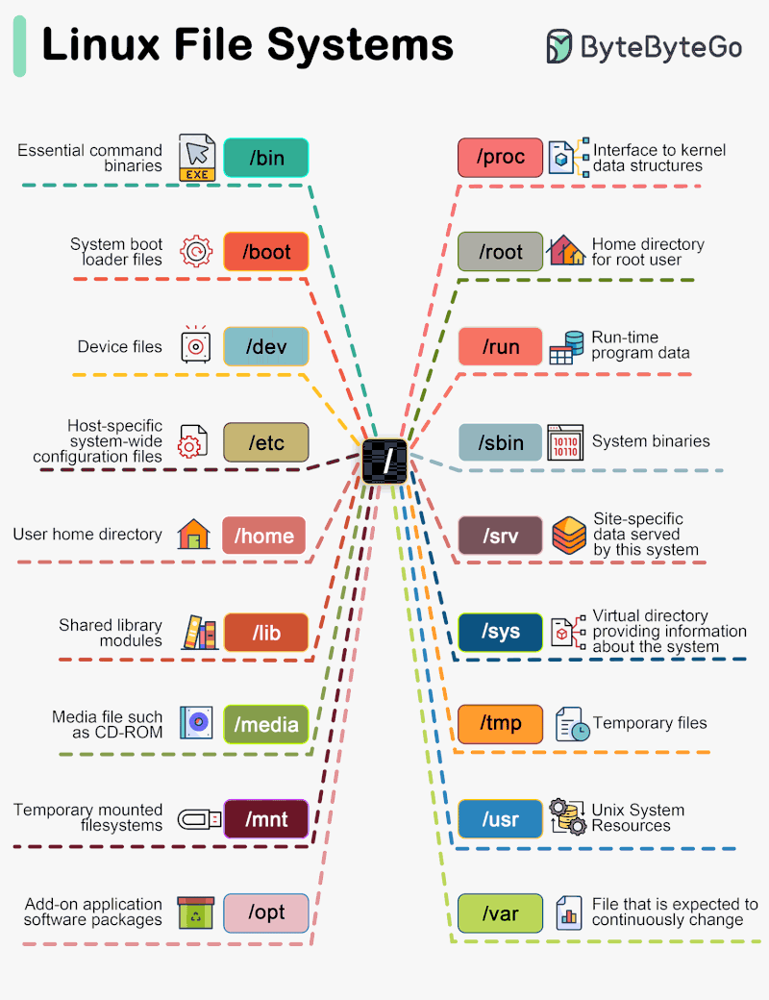

# The Linux File System

- [The Linux File System](https://www.linkedin.com/posts/bytebytego_systemdesign-coding-interviewtips-activity-7207980542296735744-psLQ)
- 

- In 1994 the Filesystem Hierarchy Standard (FHS) was introduced
  to bring order to the Linux file system
    - Not all Linux distributions strictly adhere to this standard

*Somewhat categorized by me, but perhaps could be categorized better:

- `/boot` System boot loader files
- `/proc` Interface to kernel data structures
- `/usr` Unix system resources

- `/run` Run-time program data

- `/dev` Device files
- `/media` Media files such as CD-ROM
- `/mnt` Temporary mounted filesystems

- `/bin` Essential command binaries
- `/sbin` System binaries
  - I believe requiring `sudo`?

- `/etc` Host specific system-wide configuration files
- `/opt` Add-on application software packages
- `/lib` Shared library modules

- `/home` User home directory
- `/root` Home directory for root user

- `/srv` Site-specific data served by this system
- `/sys` Virtual directory providing information about this system

- `/tmp` Temporary files
- `/var` Files that are expected to change continuously
